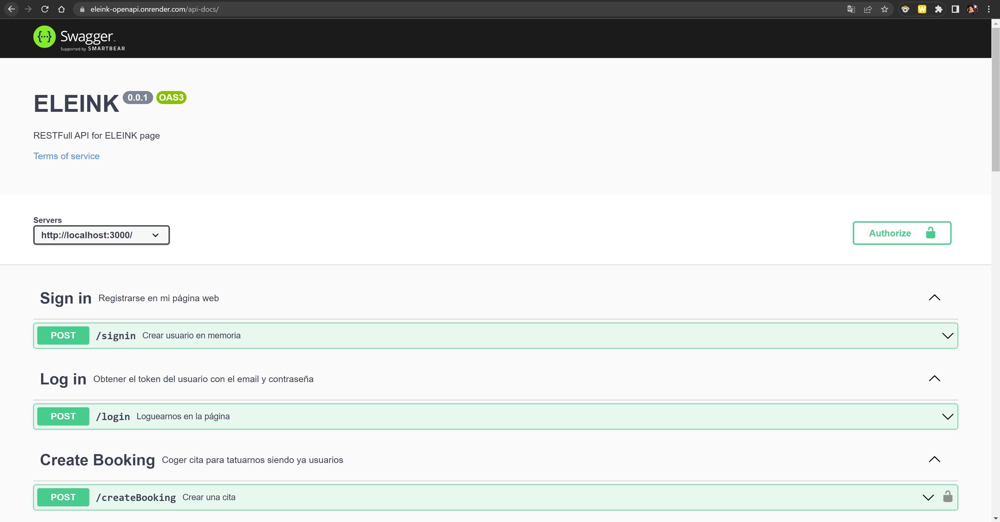
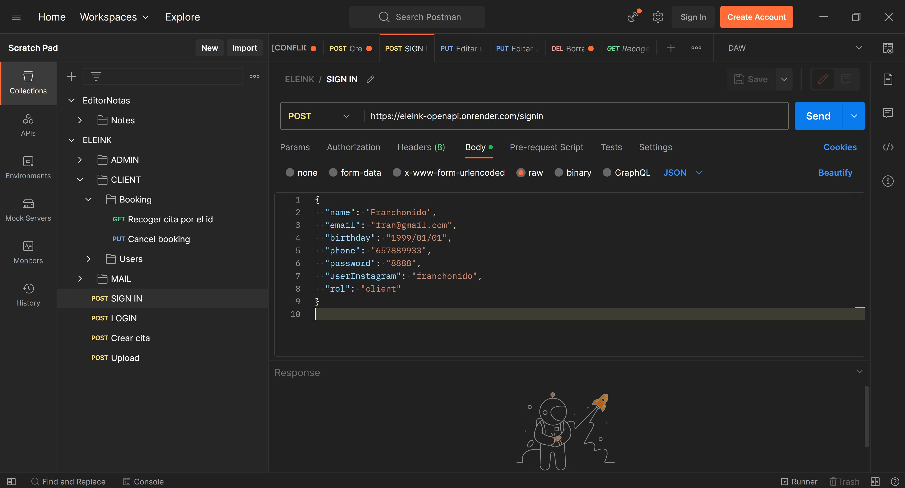
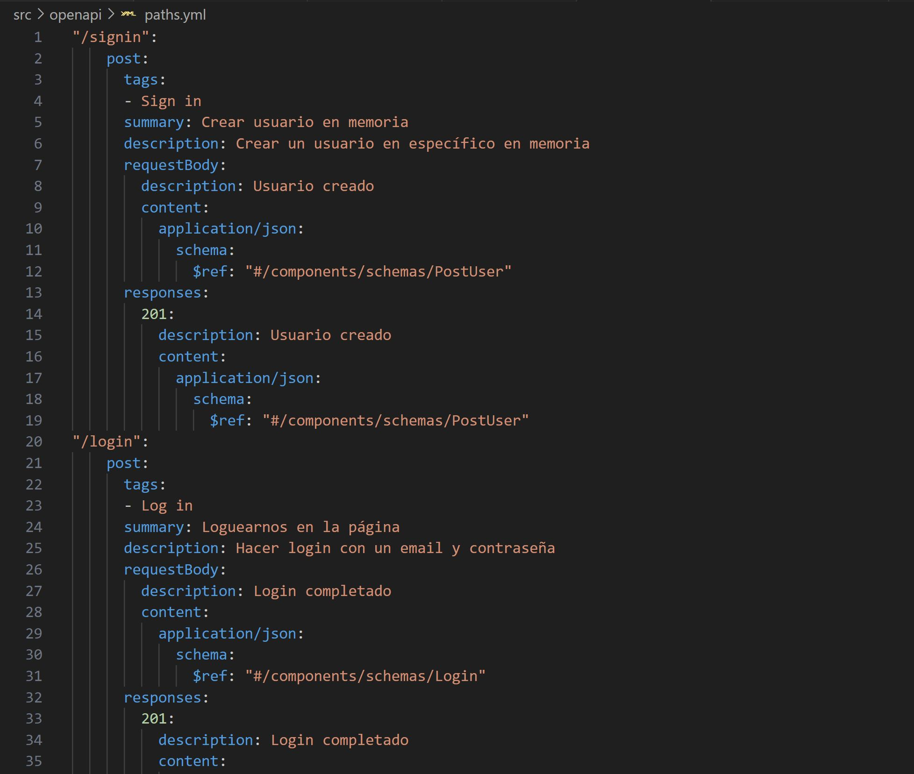
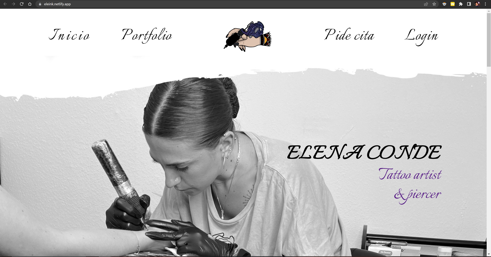

# ELEINK 💉

## ¿De qué va la página web? 🔍
ELEINK  es el nombre artístico de Elena Conde, una tatuadora que reside actualmente en Madrid. 
La página web es un conjunto de páginas donde estarías su portfolio, una página para poder coger cita y otra donde comprar su merchandising.

### PROTOTIPADO

### BACKEND

### POSTMAN

### UML

### YAML

### FRONTEND

